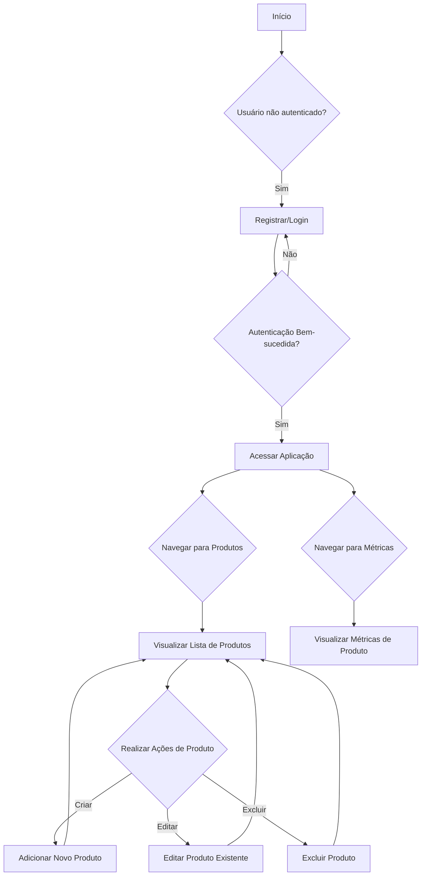

#  Desafio Técnico – Vaga Front-End 


## Descrição
Este é um aplicativo Next.js para gerenciamento de produtos, incluindo autenticação de usuário, operações CRUD (Criar, Ler, Atualizar, Excluir) para produtos e visualização de métricas de produtos.

## Funcionalidades
- **Autenticação de Usuário**: Registro e Login de usuários.
- **Gerenciamento de Produtos**:
    - Visualizar lista de produtos.
    - Criar novos produtos.
    - Editar produtos existentes.
    - Excluir produtos.
- **Métricas de Produtos**: Visualização de dados e estatísticas relacionadas aos produtos.

## Tecnologias Utilizadas
- **Framework**: Next.js
- **UI Library**: React
- **State Management**: Zustand
- **Form Management**: React Hook Form
- **HTTP Client**: Axios
- **UI Components**: HeroUI
- **Charting**: Recharts
- **Schema Validation**: Zod
- **Styling**: Tailwind CSS

## Como Começar

### Pré-requisitos
Certifique-se de ter o Node.js e o pnpm instalados em sua máquina.

### Instalação

1.  **Clone o repositório:**
    ```bash
    git clone <git@github.com:airtonsena10/crudproduts.git>
    cd crudproduts
    ```
2.  **Instale as dependências:**
    ```bash
    pnpm install
    ```

### Executando o Projeto

1.  **Modo de Desenvolvimento:**
    ```bash
    pnpm dev
    ```
    O aplicativo estará disponível em `http://localhost:3000`.

2.  **Construindo para Produção:**
    ```bash
    pnpm build
    ```

3.  **Iniciando em Modo de Produção:**
    ```bash
    pnpm start
    ```

## Fluxo Principal da Aplicação

Este diagrama Mermaid ilustra o fluxo principal de interação do usuário com a aplicação, desde a autenticação até o gerenciamento de produtos e visualização de métricas.


